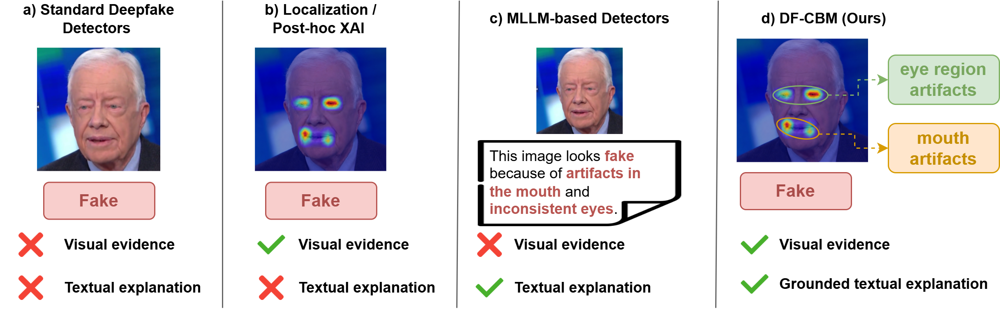
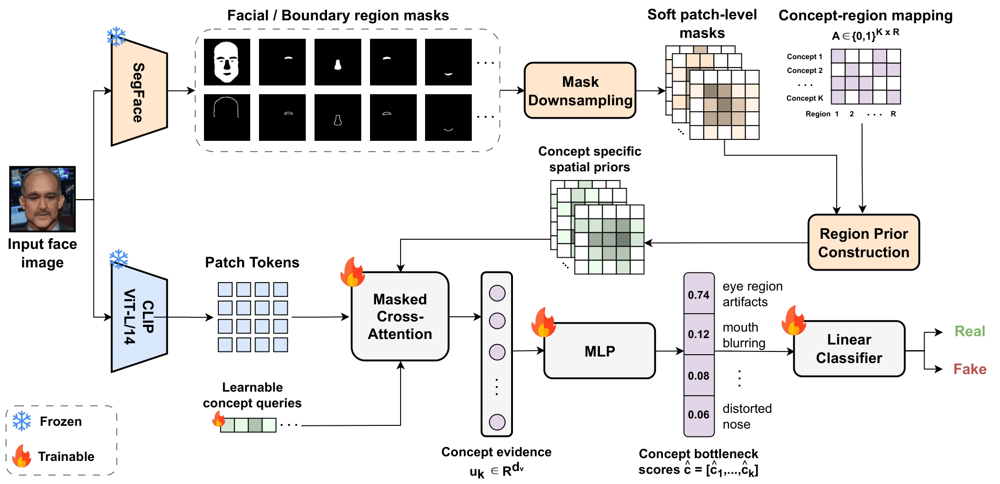
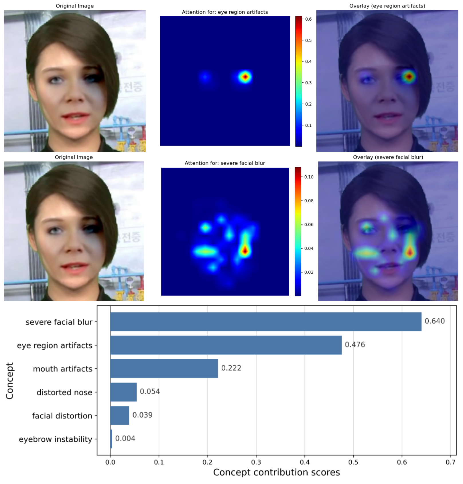
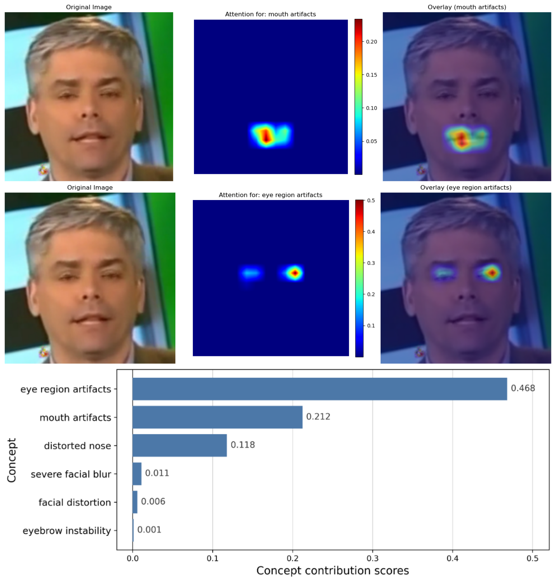

# DF-CBM: Region-Aware Concept Bottleneck Models for Deepfake Detection [ECCV 2026]

[](https://arxiv.org/abs/2609.35096)
[](https://openreview.net/pdf?id=bYrm43rif5)

Official PyTorch implementation of **[DF-CBM: Region-Aware Concept Bottleneck Models for Deepfake Detection](https://arxiv.org/abs/2609.35096)**. If you use this code for your research, please cite our paper.



> **DF-CBM: Region-Aware Concept Bottleneck Models for Deepfake Detection** <br>
> Georgios Tsoumplekas, Vazgken Vanian, Alexandros Doumanoglou, Panos K. Papadopoulos, Yannis Spyridis, Dimitrios Zarpalas, Vasileios Argyriou <br>
> European Conference on Computer Vision (ECCV), 2026 <br>
>
> **Abstract**: Deepfake detection methods have become increasingly effective, yet most provide limited insight into the evidence behind their predictions. In forensic settings, users also need to know which manipulation cues support the decision and where they appear. Existing explainability methods only partly address this need: localization-based approaches lack semantic descriptions, while language-based explanation methods are only weakly grounded in visual evidence. This paper proposes DF-CBM, a region-aware concept bottleneck model for explainable deepfake detection. DF-CBM builds a compact vocabulary of manipulation-related concepts from textual artifact annotations and links each concept to plausible facial and boundary regions. It then predicts these concepts from visual features with a concept-specific masked attention mechanism guided by parsed facial masks, and the final real/fake decision is made from the predicted concept bottleneck. Experiments show that DF-CBM outperforms concept-based baselines in concept prediction and deepfake classification while remaining competitive with state-of-the-art black-box detectors. Qualitative results and intervention analyses show that DF-CBM provides spatially grounded concept evidence and supports counterfactual explanations of how individual manipulation concepts influence the final prediction.



## 🛠️ Installation

From the repository root:

```bash
conda create -n dfcbm python=3.10 -y
conda activate dfcbm
pip install -r requirements.txt
```

## 📦 Models

Download the weights below and place them as follows:

```text
weights/
└── segface_celeba_swin_base_224.pt
checkpoints/
└── df_cbm_best_video_auc.ckpt
```

| Model | Download |
| --- | --- |
| SegFace (CelebAMask-HQ, Swin-B, 224) | [swinb_celeba_224/model_299.pt](https://huggingface.co/kartiknarayan/SegFace/blob/main/swinb_celeba_224/model_299.pt) |
| DF-CBM | [df_cbm_best_video_auc.ckpt](https://drive.google.com/file/d/1d-k1pGSXs5U01C66ZRgUTWCxMrVCwyCy/view?usp=drive_link) |

SegFace is the CelebAMask-HQ face parser from [SegFace](https://github.com/Kartik-3004/SegFace). Save the Hugging Face file as `weights/segface_celeba_swin_base_224.pt`.

## 📂 Datasets

Download the files below and place them under `data/` as follows.

```text
data/
├── concept_labels.json
├── concept_region_mapping_matrix.csv
├── dataset_json/
│   ├── FaceForensics++.json
│   ├── DeepFakeDetection.json
│   ├── Celeb-DF-v2.json
│   ├── DFDC.json
│   ├── DFDCP.json
│   ├── UADFV.json
│   ├── blendface_ff.json
│   ├── e4s_ff.json
│   ├── facedancer_ff.json
│   ├── fsgan_ff.json
│   ├── inswap_ff.json
│   ├── mobileswap_ff.json
│   ├── simswap_ff.json
│   └── uniface_ff.json
├── examples/
│   └── qualitative_images.txt
├── ffpp_splits/
│   ├── train.json
│   ├── val.json
│   └── test.json
└── rgb/
```

| File | Download |
| --- | --- |
| `concept_labels.json` | [Google Drive](https://drive.google.com/file/d/1yTpUEbvDrpypCLA63DpKCXta2a_GhzKb/view?usp=drive_link) |
| `concept_region_mapping_matrix.csv` | [Google Drive](https://drive.google.com/file/d/1p3YbE5zDjsIYcS8H4_RFArbqdD9YRNWU/view?usp=drive_link) |
| `dataset_json/*.json` | [Google Drive](https://drive.google.com/drive/folders/1rbIbwvbYfbwL5HWWV5j_zg4L_R9RBeeO?usp=drive_link) |
| `ffpp_splits/{train,val,test}.json` | [Google Drive](https://drive.google.com/drive/folders/1GXjTxYzGrui_aLA_lYRCnI660lmedHhS?usp=drive_link) |

Copy the FaceForensics\+\+ video-id splits into the FaceForensics\+\+ dataset root before training:

```bash
mkdir -p data/rgb/FaceForensics++
cp data/ffpp_splits/train.json data/ffpp_splits/val.json data/ffpp_splits/test.json data/rgb/FaceForensics++/
```

### 🖼️ RGB frames

Image datasets are the preprocessed RGB crops released with [DeepfakeBench](https://github.com/SCLBD/DeepfakeBench#2-download-data). Download the RGB archive from [Google Drive](https://drive.google.com/drive/folders/1N4X3rvx9IhmkEZK-KIk4OxBrQb9BRUcs?usp=drive_link) and place each dataset directory in `data/rgb/`. The DF40 methods  are in the [DF40 image folder](https://drive.google.com/drive/folders/1980LCMAutfWvV6zvdxhoeIa67TmzKLQ_). Place each method under `data/rgb/<method>/ff/frames/`.

After download, `data/rgb/` should look like this:

```text
data/rgb/
├── FaceForensics++/
│   ├── train.json
│   ├── val.json
│   ├── test.json
│   ├── original_sequences/
│   │   ├── youtube/c23/frames/<video_id>/<frame_id>.png
│   │   └── actors/c23/frames/<video_id>/<frame_id>.png
│   └── manipulated_sequences/
│       ├── Deepfakes/c23/frames/<video_id>/<frame_id>.png
│       ├── Face2Face/c23/frames/<video_id>/<frame_id>.png
│       ├── FaceSwap/c23/frames/<video_id>/<frame_id>.png
│       ├── NeuralTextures/c23/frames/<video_id>/<frame_id>.png
│       ├── FaceShifter/c23/frames/<video_id>/<frame_id>.png
│       └── DeepFakeDetection/c23/frames/<video_id>/<frame_id>.png
├── Celeb-DF-v2/
│   ├── YouTube-real/frames/<video_id>/<frame_id>.png
│   ├── Celeb-real/frames/<video_id>/<frame_id>.png
│   └── Celeb-synthesis/frames/<video_id>/<frame_id>.png
├── DFDC/
│   └── test/frames/<video_id>/<frame_id>.png
├── DFDCP/
│   ├── original_videos/frames/<video_id>/<frame_id>.png
│   ├── method_A/frames/<video_id>/<frame_id>.png
│   └── method_B/frames/<video_id>/<frame_id>.png
├── UADFV/
│   ├── real/frames/<video_id>/<frame_id>.png
│   └── fake/frames/<video_id>/<frame_id>.png
├── blendface/ff/frames/<video_id>/<frame_id>.png
├── e4s/ff/frames/<video_id>/<frame_id>.png
├── facedancer/ff/frames/<video_id>/<frame_id>.png
├── fsgan/ff/frames/<video_id>/<frame_id>.png
├── inswap/ff/frames/<video_id>/<frame_id>.png
├── mobileswap/ff/frames/<video_id>/<frame_id>.png
├── simswap/ff/frames/<video_id>/<frame_id>.png
└── uniface/ff/frames/<video_id>/<frame_id>.png
```

## 📊 Reproducing the results

### 🚀 Training

From the repository root:

```bash
python training/lightning_train_cbm.py --config training/configs/config.yaml
```

### 📈 Evaluation

FaceForensics\+\+ test split (frame-level and video-level detection and concept metrics):

```bash
python training/evaluate_cbm.py \
  --checkpoint checkpoints/df_cbm_best_video_auc.ckpt \
  --target ffpp \
  --splits test \
  --output-json outputs/ffpp_test.json
```

DF40 methods and the cross-dataset benchmarks listed in `evaluation_config`:

```bash
python training/evaluate_cbm.py \
  --checkpoint checkpoints/df_cbm_best_video_auc.ckpt \
  --target cross \
  --output-json outputs/cross_dataset.json
```

`--target both` runs the two evaluations together. `--datasets` overrides the JSON benchmark list, for example `--datasets Celeb-DF-v2,DFDC`.

### 🔍 Visualisations

To create concept attention maps and concept contribution score plots for a few example images run:

```bash
python training/plot_qualitative_examples.py
```





## 📝 Citation

```bibtex
@inproceedings{tsoumplekas2026dfcbm,
  title     = {{DF}-{CBM}: Region-Aware Concept Bottleneck Models for Deepfake Detection},
  author    = {Georgios Tsoumplekas and Vazgken Vanian and Alexandros Doumanoglou and Panos K. Papadopoulos and Yannis Spyridis and Dimitrios Zarpalas and Vasileios Argyriou},
  booktitle = {2026 Workshop on AI for Multimedia Forensics {\&} Disinformation Detection},
  year      = {2026},
  url       = {https://openreview.net/forum?id=bYrm43rif5}
}
```

## 🙏 Acknowledgements

We thank [Narayan et al.](https://github.com/Kartik-3004/SegFace) for the CelebAMask-HQ SegFace face parser, [Kirillov et al.](https://github.com/facebookresearch/segment-anything) for the Segment Anything transformer blocks used in that parser, and [Radford et al.](https://github.com/openai/CLIP) for CLIP ViT-L/14 used for visual features.
